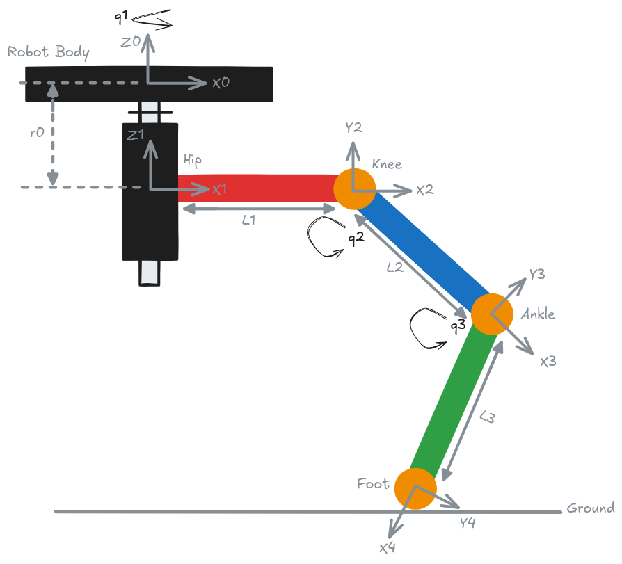
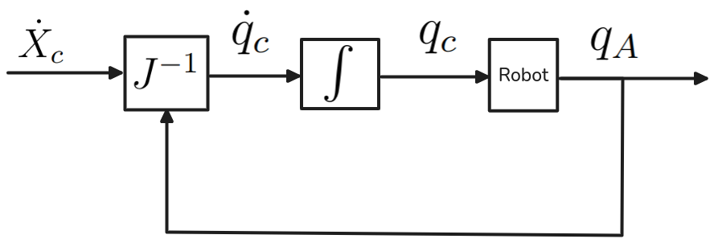
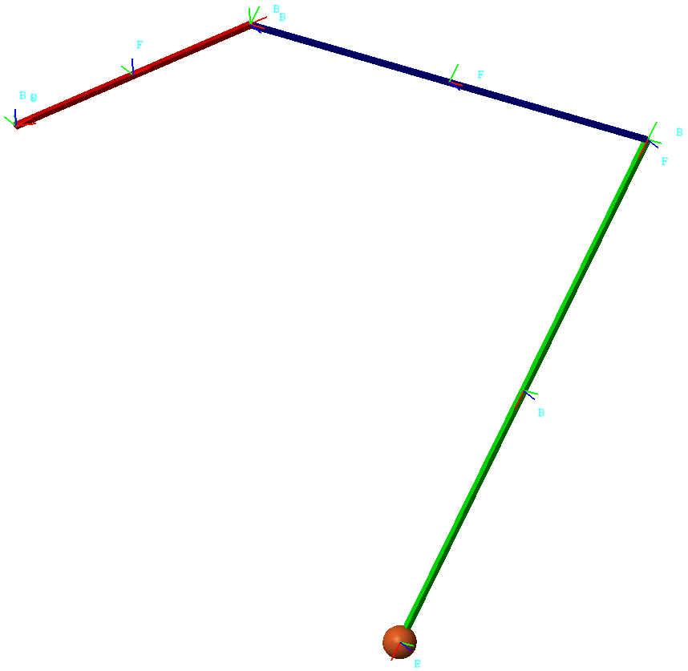
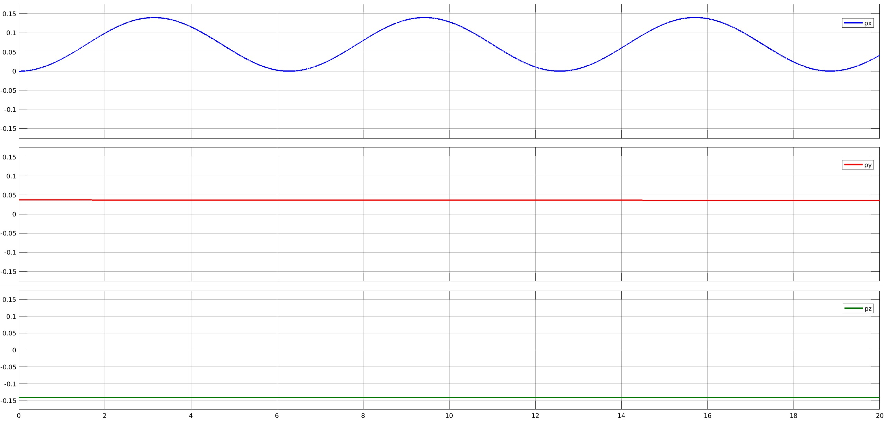
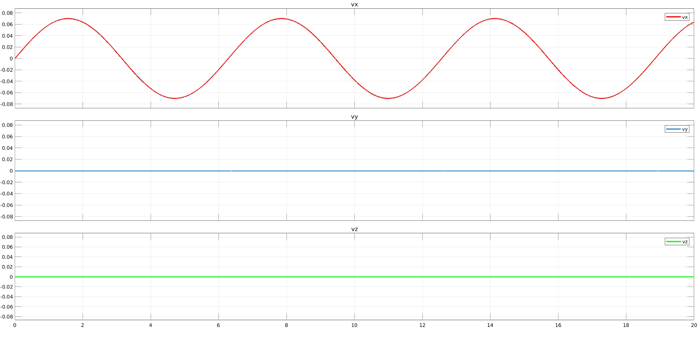
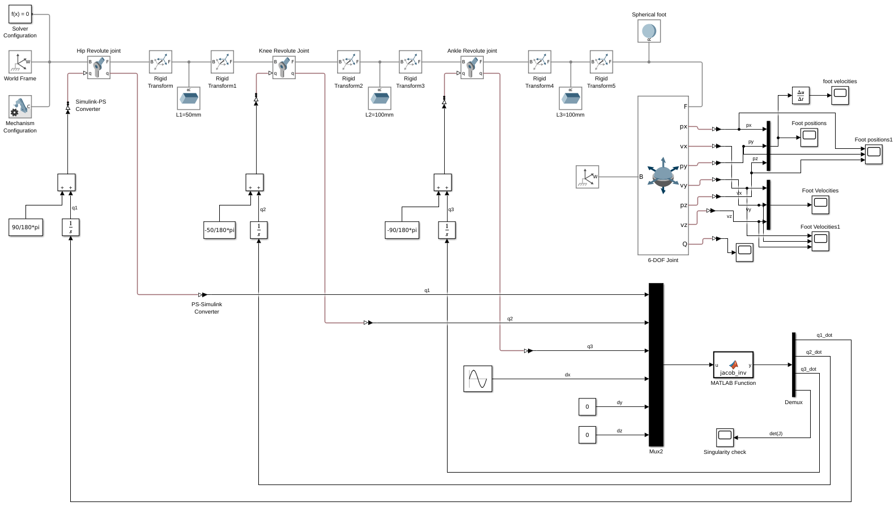
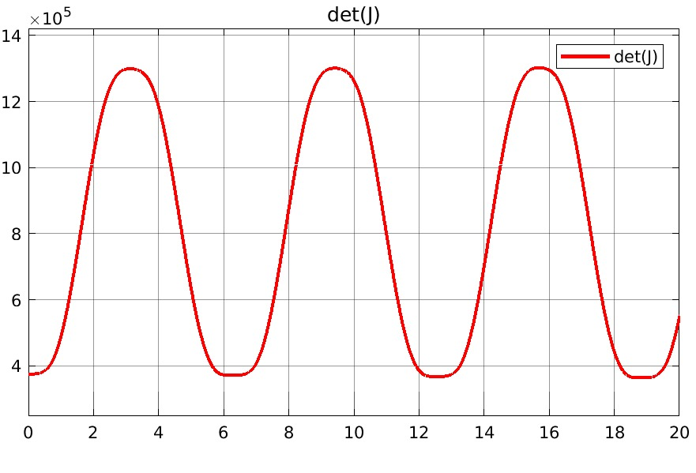
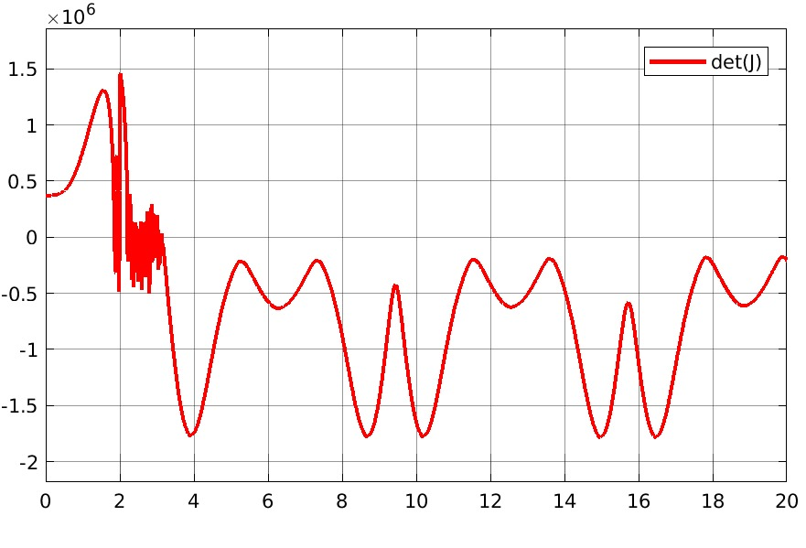
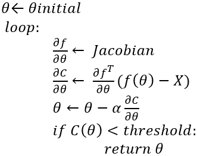

# Modeling & Control of a Hexabot leg

## Introduction
Hexabots are one of the well-known locomotion mechanisms in Robotics. They use several robotic arms to construct their legs which are connected to a base known as the robot body.  

The hexabot Leg is composed of 3 revolute joints; the hip (q1), the knee (q2), and the ankle (q3). The footprint is considered as punctual. This kinematic chain can move the foot tip along an elliptic path relative to the ground frame, so it would be able to generate steps.

This project discusses the kinematic model of a single hexabot leg. In addition, the control of the hexabot leg foot to generate desired motions and velocities is discussed with the help of MATLAB \& SIMULINK and a Simscape Multibody Simulation.

Hexabot leg

For detailed calculations and further analysis, please refer to the [project report](Report_MIR_Hexabot_Mohamed_Atta.pdf).

## Foot Motion Control
Controlling and planning the motion of manipulators can be done by different techniques. Motion control can be done in either joint or task space. The robot jacobians can be used to control the robot end-effector speed and position in the cartesian task space. 

In my real-world applications, it is required for the robot end-effector to move in a straight line in the cartesian space. Resolved-rate motion control is a Jacobian-based motion control method that can be used to generate a strictly forward foot step without generating any other motion to the whole robot body. The method works without having to compute the inverse kinematics at each time step. Instead, the inverse of the Jacobian matrix alone is recomputed at each time step to account for the updated joint variables as shown below:

Resolved-Rate Motion Control Algorithm

Simscape and Multibody ,which are 2 toolboxes of Matlab / Simulink, are used to model the hexabot leg as well as control its motion. 

Hexabot leg model created using Simscape Multibody

Provided the main robot axis (longitudinal axis to move forward) is lining with X-ground, we can control the leg to generate a strictly forward step in the main robot axis (X-axis) by inputting velocity values along x-axis only to the inverse jacobian function, while keeping the velocity values along y and z-axes as zeros. For testing the method, a sine function with an amplitude of 70 is provided as the x-axis velocities during the simulation. The outputs of the position and speed of the foot indicate clearly that the motion is executed along the x-axis only: 

Hexabot leg foot positions during simulation

Hexabot leg foot velocities during simulation

Simulink Model of the Hexabot Leg

Another important aspect that can be studied using the jacobian matrix during simulation is the robot singularities. To detect which configurations are near the singularity, the determinant of the jacobian matrix is calculated at each time step. The robot is having a singularity configuration when the determinant is zero. The portions of the simulation with determinant values near the zero are considered important as it could be studied for improving the path and motion planning techniques used in order to be avoid singularities in the future. 

During simulating the model using a sine function with an amplitude of 70 as a velocity input along x-axis, the robot didn't reach a singularity position during its motion. However, when the amplitude of the sine wave is increased to be 150, a number of singularities happened. Increasing the amplitude of the sine wave input makes the robot explore a wider range of its workspace, which increases the likelihood of encountering singularities as shown below:

Singularity Check with Sine Amplitude=70

Singularity Check with Sine Amplitude=150

Motion control with the help of Jacobians is an important topic to be considered during working with manipulators. Another method that can be used to actuate the foot in the x-axis direction only using Jacobians is to solve the inverse kinematics problem numerically by iteratively guessing the solution until it becomes within a certain threshold. This is done by formulating the problem as an optimization one. The optimization method aims at minimizing the difference between the robot's end effector current and desired cartesian position. Thus, the cost function will be the euclidean distance between these two position. Gradient descent is used as the optimization algorithm. It iteratively adjusts the joint angles of the robotic arm to minimize the difference between the current end-effector position and the desired end-effector position. In each iteration, the algorithm calculates the gradient of the cost function with respect to the joint angles, and then updates the joint angles by taking a step in the direction of the negative gradient.Once the gradient is calculated, the joint angles can be updated using the following equation: $\theta_i = \theta_i - \alpha \frac{\partial C}{\partial \theta_i}$ :

Jacobian-Based Inverse Kinematics Algorithm using gradient descent

## Simulation Results

